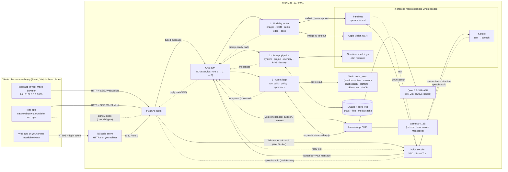

<h1>
  <picture>
    <source media="(prefers-color-scheme: dark)" srcset="assets/brand/svg/lockup-horizontal-on-dark.svg">
    
  </picture>
</h1>

**A private AI assistant that runs entirely on your Mac, and works completely offline.** Chat, talk, share photos, screenshots, documents, audio and video, and even create short videos. Everything runs on your Apple Silicon Mac, with no account, no cloud and no subscription. Once it's installed you can switch off the Wi-Fi: only web search needs the internet.

[Website and docs](https://local.gorunrun.ai) · [Install](#install) · [Developer quick start](#quick-start) · [License](#license)

- Streaming chat with branching, editing and regeneration
- Text, image, screenshot, voice-message, document and video input
- Live voice conversation that you can interrupt
- Tools: sandboxed Python, file search, memory, web search and fetch, MCP servers
- Artifacts (HTML, React, SVG, diagrams), projects and long-term memory
- Local video generation with sound (LTX-2.3) and Wan 2.2, including animating your photos
- Use it from your phone's browser, connecting to your Mac over your private Tailscale network

**Your data stays on your Mac.** All models run locally on the GPU with Apple's MLX. The network is used only for downloading models at setup, and for tools you turn on (web search and fetch). A phone can reach the Mac only through your own Tailscale network with a login token.

## Install

On an Apple Silicon Mac with 32 GB or more of memory (64 GB for the default model; 48 GB for video creation), open Terminal and run:

```sh
curl -fsSL https://raw.githubusercontent.com/gorunrunai/local-ai/main/install.sh | bash
```

The installer opens in its own screen (your terminal comes back as it was when it closes), checks your Mac, and asks two questions. The first is which AI model to use: **Qwen 3.5** (the default, for Macs with 64 GB or more; about 32 GB to download) or the lighter **Gemma 4** (about 13 GB; the only choice on Macs with less memory). The second is video creation (48 GB Macs and up), included by default on 64 GB Macs with **LTX-2.3** (with sound; about 28 GB). You can instead pick **LTX-2.3 and Wan 2.2** (about 52 GB), **Wan 2.2** only (about 24 GB, no sound), or no video. It then installs what it needs, downloads the models, and adds **GoRunRun Local AI** to your Applications folder. You can also use it in any browser at http://127.0.0.1:8000. To see the questions and the plan first without changing anything, add `--dry-run`: `curl -fsSL https://raw.githubusercontent.com/gorunrunai/local-ai/main/install.sh | bash -s -- --dry-run`. Add `--machine=M4Max-48GB` (any chip and memory) to `--dry-run` to preview what a different Mac would get. Step-by-step instructions with screenshots are at [local.gorunrun.ai](https://local.gorunrun.ai). Windows and Linux support is planned.

What each Mac gets, by memory: 32–47 GB runs Gemma 4 without video; 48 GB adds optional LTX-2.3 video; 64 GB and more runs everything. Only 64 GB (an M5 Max) has been tested so far. [See the full table and help us test other sizes](https://local.gorunrun.ai/macs/): open a [test report](https://github.com/gorunrunai/local-ai/issues/new?template=config_test.yml) or email amit@gorunrun.ai. The app's home screen shows your setup and its limitations, and grays out features your setup can't do.

## Contents
[Install](#install) · [Quick start](#quick-start) · [Architecture](#architecture) · [Models and modalities](#models-and-modalities) · [Using it](#using-it) · [Configuration](#configuration) · [Privacy and security](#privacy-and-security) · [Phone access](#phone-access) · [Tests](#tests) · [Benchmarks](#benchmarks) · [Troubleshooting](#troubleshooting) · [Repository layout](#repository-layout)

## Quick start

For developers working from a clone of this repository.


Requirements:
- An Apple Silicon Mac with 32 GB+ of unified memory (64 GB recommended; developed on an M5 Max with 64 GB)
- macOS 26
- [Homebrew](https://brew.sh)
- About 40 GB of free disk for models (55 GB more for video generation)

```sh
make setup      # brew deps (ffmpeg, uv, node), Python env, llama-swap, models, web search, fixtures, web app
make backend    # API + model server on http://127.0.0.1:8000 (serves the web app too)
```

Open **http://127.0.0.1:8000**. For frontend development with hot reload, use `make dev` (http://127.0.0.1:5173).

Optional extras:

```sh
make remote            # phone access over Tailscale (same as the switch in Settings → Phone access)
make gpu-limit         # how to give Metal more memory (see Troubleshooting)
```

The first start loads Qwen3.5-35B-A3B (about 20 GB) and primes its prompt cache, which takes 10–20 s. After that, replies start in well under a second.

## Architecture



Solid arrows are requests, dotted arrows are what comes back, and `<-->` is a call that returns its result. Every turn, typed or spoken, goes through the same three steps, run in order by the chat turn:

1. The **modality router** turns attachments into something the model can read: images and video keyframes, text from screenshots (Apple Vision), transcripts of audio and video (Parakeet).
2. The **prompt pipeline** assembles the messages: system prompt, project, saved memories and retrieved passages (through the embeddings, reranker and database), and the chat history.
3. The **agent loop** streams the messages to the model through llama-swap. If the model calls a tool, the result goes back into the messages and the model continues. The reply streams back to the client as it's written.

**Speech never goes to the model as audio, except voice messages.** In Talk mode, Parakeet turns your speech into text, and that text is your message. On the way back, Kokoro turns the reply text into speech, one sentence at a time; its audio goes only to your device, never to the model. Voice messages you record are the exception: Gemma listens to the audio itself and writes a note on what you said and how, which goes into the prompt.

There are three clients, all the same web app:
- **Your Mac's browser** at `http://127.0.0.1:8000`, while the backend is running.
- **The Mac app** (`desktop/`), a native window around the same web app. Opening it starts the backend through a LaunchAgent, and quitting stops it unless **Keep Running in Background** is on.
- **Your phone's browser**, over your own Tailscale network. Settings → Phone access turns on `tailscale serve`, which forwards HTTPS from your tailnet to the backend on 127.0.0.1, and a login token protects it. **Add to Home Screen** installs it as an app (a PWA: its interface is cached on the phone; everything else comes from your Mac).

**A turn, step by step:**
1. **Upload.** Files are stored by content hash.
2. **Modality router.** Each attachment either goes to the model as-is or is converted:
   - images are normalized with EXIF and GPS stripped
   - screenshots also get on-device OCR
   - audio is transcribed with timestamps
   - video becomes scene-change and uniform keyframes plus a timed transcript
   - documents are converted to text (PDF, DOCX, PPTX, XLSX, CSV, Markdown, code), with OCR for scanned pages
3. **Prompt pipeline.** Ordered stages assemble the prompt, each with a token budget. Stable content comes first so the model's prompt cache is reused.
4. **Agent loop.** The model can call tools. Every call goes through the policy hook (allow, ask first or block). Tool results go back to the model marked as untrusted data.
5. **Streaming.** Everything streams to the UI over SSE: text, thinking, tool cards, media progress and citations.


## Models and modalities

| Role | Model | Runtime | Resident memory |
|---|---|---|---|
| Main model (answers every turn) | **Qwen3.5-35B-A3B** 4-bit (MoE, 3B active) | mlx-vlm behind llama-swap, prefix cache in RAM | 20.3 GB |
| Voice-message listener | **Gemma 4 12B** 4-bit (hears audio natively) | mlx-vlm, loaded on demand, unloads after 15 min | 8.7 GB |
| Speech-to-text | Parakeet TDT 0.6B v2 (English) · Whisper large-v3-turbo (99 languages) | parakeet-mlx · mlx-whisper | about 1.2 GB |
| Text-to-speech | Kokoro-82M (54 voices) | mlx-audio | about 0.3 GB |
| Turn detection | Silero VAD v6 + Smart Turn v3.2 | torch CPU · ONNX | under 0.1 GB |
| Embeddings / reranking | Granite-Embedding-311M-R2 · ettin-reranker-400m | sentence-transformers (MPS) | about 3 GB |
| OCR | Apple Vision | PyObjC | n/a |

**Modality support:**

| Input | Qwen3.5-35B-A3B (default) | Gemma 4 12B | How it reaches the answering model |
|---|---|---|---|
| Text | ✓ | ✓ | as-is |
| Images and photos (HEIC, WebP, PNG, JPEG) | ✓ native | ✓ native | resized; EXIF and GPS stripped |
| Screenshots | ✓ native | ✓ native | the image plus on-device OCR text |
| Voice messages (up to 30 s) | ✗ | ✓ native | Gemma listens and writes a gist and delivery (tone) note; Qwen answers from that plus Parakeet's transcript |
| Longer audio (m4a, mp3, wav, webm, ogg) | ✗ | ✗ over 30 s | Parakeet transcript with timestamps |
| Video (mp4, mov, webm, screen recordings) | ✓ native (opt-in) | ✓ native (60 s or less) | Default: up to 32 keyframes (scene cuts plus uniform coverage) as timestamped images, plus a transcript |
| Documents | via text | via text | extracted text; long documents indexed for retrieval |

Change models, limits and budgets in [`config/models.yaml`](config/models.yaml).

## Using it

- **Attach anything.** Paste screenshots with ⌘V, drag and drop files, use the paperclip, capture the screen or a window, or take a photo or clip with the camera. Video and audio show processing progress.
- **Voice:**
  - The **Talk** button (⌘⇧V) starts a live conversation. You can interrupt by talking or by pressing Space.
  - The mic button dictates into the message box as you speak: tap it, hold it, or hold Right ⌥ anywhere.
  - The waveform button records a voice message the model hears, including your tone.
- **Branching.** Edit any message, or retry a reply with extended thinking or another model, then switch between versions with ‹ n/m ›.
- **Tools.** You'll see tool cards with arguments, results and timings; tools that need approval ask with **Allow / Deny**. `code_exec` charts appear inline.
- **Artifacts.** HTML, SVG, React, Mermaid and Markdown open in a side panel with version history. **Preview** turns any HTML or JSX code block into one.
- **Projects.** Shared instructions and knowledge files for a set of chats.
- **Memory.** Say "remember…"; you can review and edit memories in Settings → Memory. Incognito chats never read or write memory and aren't saved.
- **Commands.** `/think` `/model` `/style` `/project`, and `@` to mention files or past chats. ⌘K starts a new chat, ⌘/ focuses the message box, Esc stops a reply, and `?` lists all shortcuts.
- **Inspect the prompt.** The `</>` icon on any reply shows the exact prompt sent to the model, with a token count per stage.
- **Export** to Markdown, JSON or PDF (print).

## Configuration

| File | What it controls |
|---|---|
| `config/models.yaml` | Models, backends, per-model limits (audio and video length, frames, image size), memory budget (45 GB), which models may run together, prompt-cache size |
| `config/tools.yaml` | Tool on/off and default policies (`allow` / `confirm` / `deny`), agent round limit, output caps |
| `config/mcp.json` | MCP servers (stdio `command` or HTTP `url`, optional `policy`). You can also edit this in Settings → Tools & MCP. See [`config/mcp.example.json`](config/mcp.example.json) |
| `config/prompts/system.md`, `config/styles/*.md` | Base system prompt and preset styles |
| `.env` (from `.env.example`) | `APP_PORT`, `DATA_DIR`, and `REMOTE_ACCESS` (default until phone access is first switched in Settings) |
| Settings (in the app) | Custom instructions, default style, memory, tool overrides, temperature and length, context size, video frame budget, voice settings |

Data lives in `data/`: the SQLite database, uploaded files, the media cache, logs and the login token. `make clean-cache` clears derived media.

**Video generation (optional).** Run `make models-video` once. It sets up a separate engine environment in `videogen/`, downloads about 52 GB of weights, and converts Wan to MLX. Then ask in any chat, for example "make a 4-second video of a fox in the snow". Name a model to choose it, or attach an image to animate it. Each render asks for approval, shows progress, and appears inline with a **Download** button.

| Model | Output | 4 s clip on M5 Max | Peak memory | Notes |
|---|---|---|---|---|
| **LTX-2.3** 22B distilled, 4-bit (default) | 768×512 (or portrait/square), up to 10 s, **with sound** | about 50 s | 16–17 GB | Qwen stays loaded |
| **Wan 2.2** TI2V-5B | 960×544, up to 5 s, no sound | about 6.5 min | 31.5 GB | Qwen is unloaded while it renders and reloads afterwards |

LTX's sound is loudness-normalized to −16 LUFS; its raw output is often too quiet to hear. Wan runs through [`videogen/wan_run.py`](videogen/wan_run.py), which keeps the text encoder in bf16 and decodes in smaller chunks: that cuts the peak from 50 GB to 31 GB. Real renders are tested with `RUN_VIDEO_TESTS=1 uv run pytest tests/integration/test_video.py -s`.

**Web search.** `web_search` uses a local [SearXNG](https://docs.searxng.org) install. `make setup` installs it into `searxng/`, or run `make search-setup` separately; no Docker is needed. The backend starts it on 127.0.0.1:8888 the first time the model searches (about 2 s) and stops it on shutdown. Search queries go to the public engines SearXNG aggregates, such as Brave and Google; nothing else leaves the Mac. Settings live in [`config/searxng.yml`](config/searxng.yml). A SearXNG you already run at that address, for example in Docker, is used as is.

## Privacy and security

- **Localhost only.** The backend and llama-swap bind to 127.0.0.1, and the backend checks the Host header, which blocks DNS-rebinding attacks. Nothing is uploaded, and there's no telemetry: `HF_HUB_OFFLINE` and `DO_NOT_TRACK` are set at runtime, and models download only during `make setup`.
- **Untrusted content stays data.** Tool output, transcripts, OCR and document text are wrapped in "untrusted data" envelopes. The model is told not to follow instructions inside them, and tests check that it ignores injected "ignore previous instructions" text in a web page and in a video's audio.
- **`code_exec`** runs in a macOS `sandbox-exec` profile:
  - no network at all, including localhost
  - it can't read your home folder or write outside its per-chat folder
  - CPU and file-size limits are hard limits the code can't raise
- **`web_fetch`** refuses private, loopback, link-local and Tailscale addresses (SSRF protection) and re-checks every redirect.
- **Artifacts** run with a CSP sandbox and an opaque origin, with `connect-src 'none'`. They can't call the app's API, reach the internet or read storage, even when opened in a new tab.
- **Incognito chats** live in an in-memory database and a temporary folder that's deleted on exit. The model's prompt cache is held in RAM only; its disk tier is disabled.

## Phone access

The phone runs only the interface; your Mac runs the models.

1. Install [Tailscale](https://tailscale.com/download) on the Mac and the phone, signed in to the same account.
2. On the Mac, turn on **Settings → Phone access → Allow access from my phone** (or run `make remote`). This runs `tailscale serve`, which gives you HTTPS on your tailnet, and turns on token checking immediately. The backend itself still listens only on 127.0.0.1.
3. On the phone, scan the QR code in Settings → Phone access (or open the sign-in link you share from there): it opens `https://<mac>.<tailnet>.ts.net`, signed in. **Add to Home Screen** installs it as an app (PWA).


## Tests

```sh
make test               # 132 Python + 15 frontend unit tests (no models needed)
make test-integration   # 28 tests against the real models: acceptance tests 1-12, voice, tools, MCP
make test-e2e           # Playwright tests: chat, voice (fake mic), artifacts, sandbox, projects, settings, phone access, updates, accessibility
make bench              # model and pipeline benchmark
make bench-voice        # voice round-trip latency (backend must be running)
```

| # | Acceptance test | Result |
|---|---|---|
| 1 | Chart screenshot values | ✓ Q2=57, Q4=68 |
| 2 | Exact error text from a screenshot | ✓ quoted verbatim |
| 3 | Dictation accuracy | ✓ WER 0.0 |
| 4 | Voice message question | ✓ "Canberra" (native audio, and the transcript fallback) |
| 5 | 75 s video: visual and audio questions with timestamps | ✓ "LOADING DOCK" @ 00:21, "marmalade" @ 01:02 |
| 6 | Voice mode round trip | ✓ 0.77–0.90 s median, end of speech to first audio (target under 2 s) |
| 7 | Multi-step tools incl. `code_exec` | ✓ two code runs; total 817, best month June |
| 8 | Memory and incognito | ✓ recalled in a new chat; incognito neither reads nor writes |
| 9 | Project knowledge | ✓ answered only inside the project (API and UI) |
| 10 | Branching | ✓ edit, switch back, regenerate |
| 11 | Artifact versions | ✓ v1 then v2, history intact |
| 12 | Prompt injection (web page and video audio) | ✓ ignored in both |

## Benchmarks

M5 Max, 64 GB, macOS 26.6, default Metal limit (`make bench`, `make bench-voice`):

| Metric | Result |
|---|---|
| Qwen3.5-35B-A3B decode | **131–137 tok/s** |
| Qwen time to first token, short prompt / repeated 2K-token system prompt (cached) | 0.08 s / 0.04 s |
| Qwen prompt processing, 5.9K uncached tokens | about 4,900 tok/s (1.2 s) |
| Gemma 4 12B decode / prompt processing | 62–66 tok/s / about 1,800 tok/s |
| STT real-time factor (Parakeet) | 0.043 (6 s clip), **0.0046** (75 s; about 220× real time) |
| TTS time to first audio (Kokoro, warm) | **63–86 ms** per sentence |
| Video preprocessing | **0.6 s per minute** of footage (30 keyframes plus transcript); cached repeat 25 ms |
| Voice mode, end of speech to first audio | **0.77–0.90 s** median; 1.27 s on the first turn after a restart |
| Interruption reaction | about 370 ms |
| Embeddings / reranking | about 260–1,000 texts/s / 16 passages in 0.26 s (MPS) |
| **Peak memory, every model loaded** | **32.9 GB** (Qwen 20.3 + Gemma 8.7 + backend 3.8) of the 45 GB budget; about 35 GB with the reranker on MPS |

## Updating

In the app, **Settings → Updates → Check for updates** compares your version (`VERSION`) with [`UPDATES.md`](UPDATES.md) on GitHub and shows what's new. It only checks when you press the button. To update, run the install command again: it fast-forwards the code, rebuilds, and keeps your chats, settings and models.

## Troubleshooting

**Metal memory ("failed to allocate", or a model won't load).** macOS lets the GPU wire about 75% of RAM by default (about 48 GB on a 64 GB Mac), which is enough for the defaults. To raise it until the next reboot:

```sh
sudo sysctl iogpu.wired_limit_mb=54000    # leave ~10 GB for macOS
```

To make it persistent, create a LaunchDaemon: `/Library/LaunchDaemons/local.iogpu.plist` running `sysctl iogpu.wired_limit_mb=54000` with `RunAtLoad`. Keep `memory_budget_gb` in `config/models.yaml` below the limit. The Models panel (sidebar) shows what's loaded and how much memory each model uses.

**Microphone, camera or screen capture doesn't work.**
- Browsers allow the mic and camera only on secure origins. `http://127.0.0.1` counts as secure; a LAN IP doesn't (use Tailscale HTTPS).
- macOS also needs permission for the browser in System Settings → Privacy & Security → Microphone / Camera / Screen Recording. After granting Screen Recording, quit and reopen the browser.

**The assistant interrupts itself in voice mode.** Echo from loud speakers can trigger interruption. Use headphones, lower the volume, or reduce voice detection sensitivity in Settings → Voice.

**ffmpeg errors.** Run `brew install ffmpeg` (`make setup` does this) and make sure `which ffmpeg` resolves inside the shell that starts the backend. Unsupported codecs show up as a note on the attachment instead of failing the reply.

**"Port in use" or a stale model server.** Run `pkill -f "uvicorn orchestrator.app"; pkill -f bin/llama-swap`, then `make backend`. llama-swap's log is at `data/logs/llama-swap.log`; it includes the model servers' output.

**Slow first reply.** The first request after startup loads the model and primes the prompt cache (10–20 s). Voice-message tone analysis loads Gemma the first time (about 4 s); pressing the mic starts that load early.

**Models missing offline.** The runtime never downloads models. Run `make models` (the default chat model and services), or `make models-all` for every configured chat model.

**Phone can't connect.** Open Settings → Phone access on the Mac: it shows whether Tailscale is connected and forwarding, and any error from Tailscale. Check that the phone is signed in to the same tailnet and that you entered the token shown there. The address has no port number.

## Repository layout

```
inference/      model manager, llama-swap config, OpenAI-compatible provider, STT/TTS/embedding services
media/          modality router, image/OCR/audio/video/document processors, content-hash cache
orchestrator/   FastAPI app: pipeline, agent loop, tools, policy, MCP client, RAG and memory, storage, voice
frontend/       React PWA (Vite), artifact runtime, Playwright tests
assets/brand/   logo, app icons and brand guide (colors, fonts, usage rules)
config/         models.yaml, tools.yaml, mcp.json, prompts/, styles/
scripts/        setup downloads, fixtures, benchmarks, voice round trip, terminal chat client
tests/          unit, integration (real models), fixtures
```

## Contributing

Contributions are welcome: see [CONTRIBUTING.md](CONTRIBUTING.md). Report security issues privately as described in [SECURITY.md](SECURITY.md).

## License

GoRunRun Local AI is licensed under the [Apache License 2.0](LICENSE). The models it downloads are not part of this repository and keep their own licenses. See [NOTICE](NOTICE) for the list.
